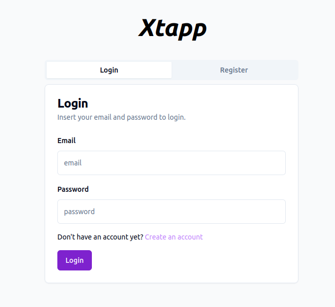

# Expense Tracker App - Xtapp

## Introduction

Xtapp is a comprehensive expense tracker application designed to help users manage their finances effectively. With Xtapp, users can easily track their expenses, set budgets, and gain insights into their spending habits, enabling them to make informed financial decisions and achieve their financial goals.
Xtapp on the web: https://www.pbead.com/hbnb_static/index.html
Author: https://www.linkedin.com/in/aderhm

## Architecture
Xtapp follows a client-server architecture, with a Flask-based backend handling data processing and storage, and a dynamic frontend built using Next.js for the user interface. The backend utilizes a MySQL database to store user data securely.

## Features

- Expense Tracking: Users can easily log their expenses and categorize them for better organization.
- Budget Management: Set monthly budgets and receive notifications when approaching or exceeding budget limits.
- Goal Setting: Define financial goals such as saving targets or debt reduction milestones, and track progress towards achieving them.
- Secure Authentication: Implement JWT-based authentication to ensure secure access to user accounts.

## Installation

It's a web application: https://www.pbead.com/hbnb_static/index.html. A mobile app is coming soon..

## Usage

Once Xtapp is running in the browser, users can:

Log In: Create an account or log in to an existing account.
Track Expenses: Add, edit, and categorize expenses to keep track of spending.
Set Budgets: Set monthly budgets and receive notifications when approaching or exceeding budget limits.
Set goals: Define financial goals such as saving targets or debt reduction milestones, and, soon, track progress towards achieving them.

## Licensing

Feel free to use, modify, and distribute the software for free.

